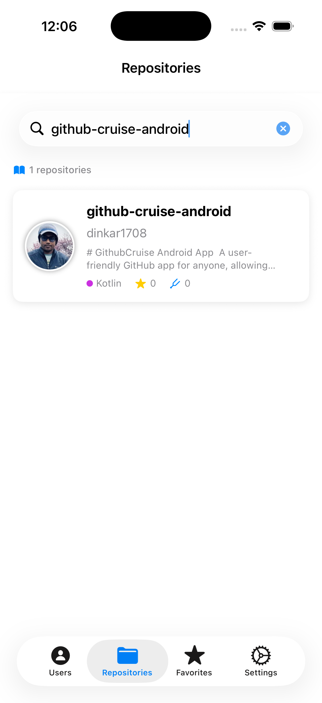
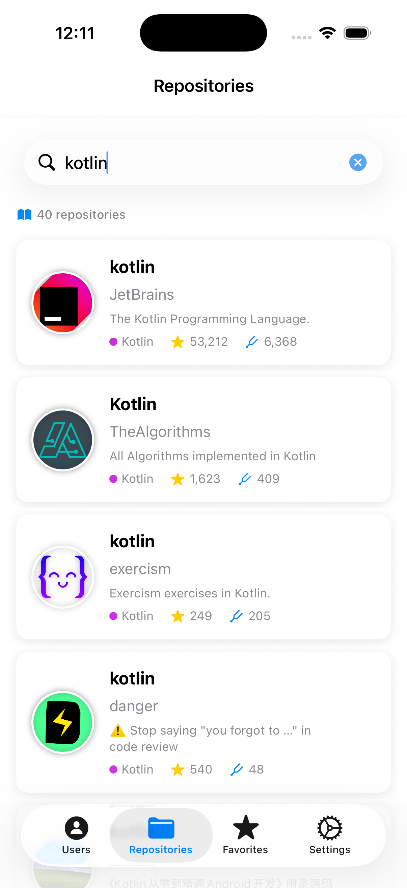
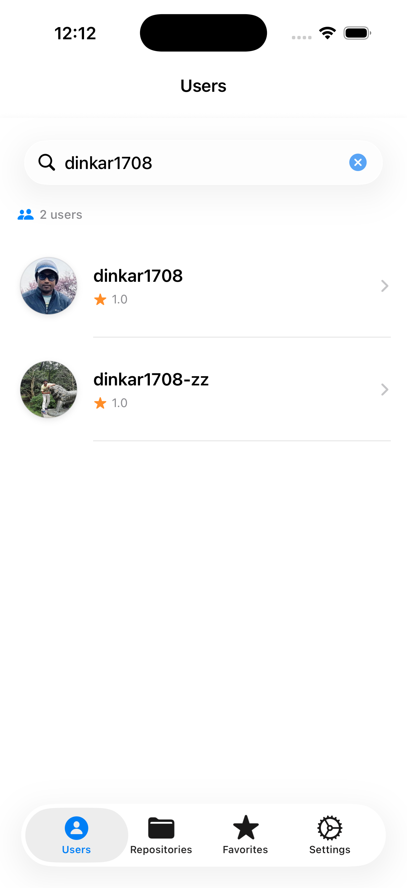
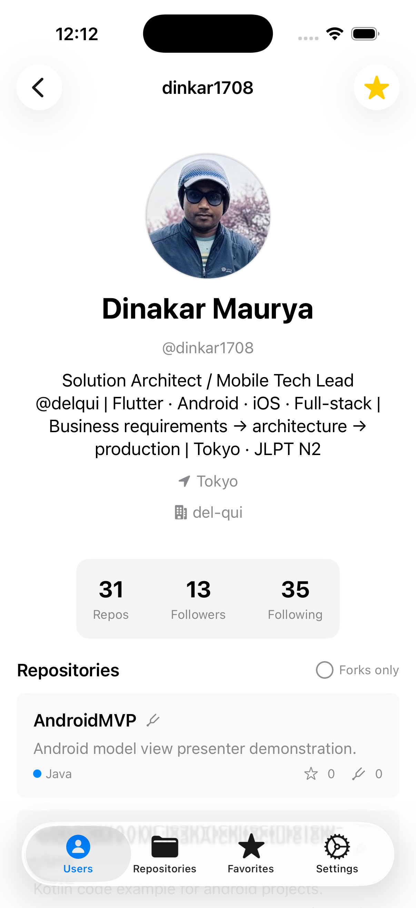
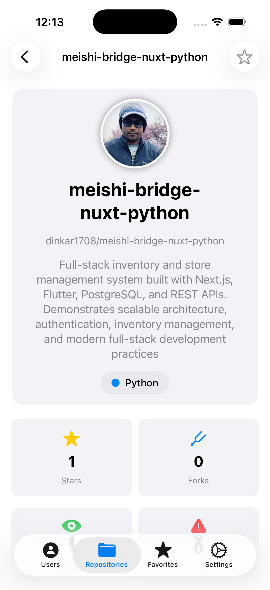
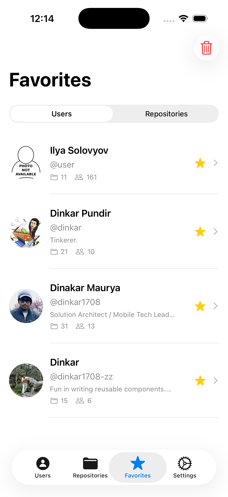
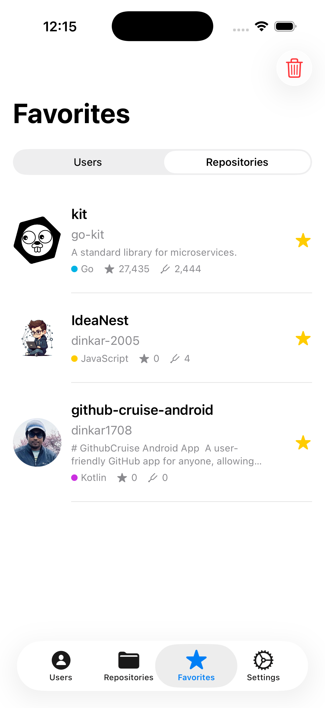
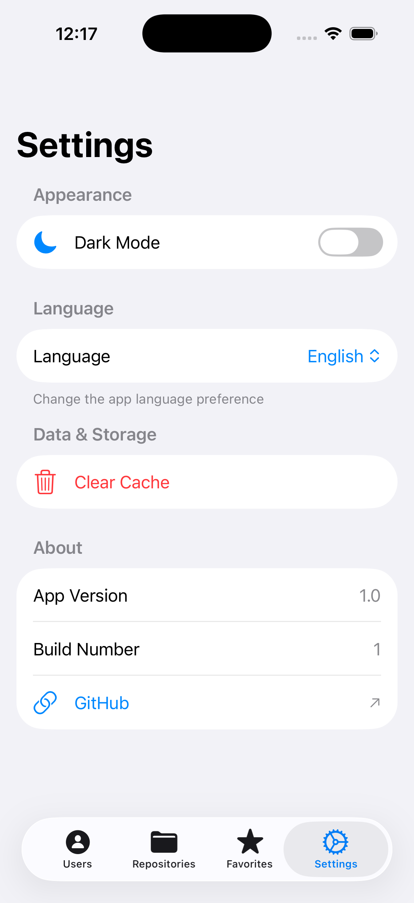
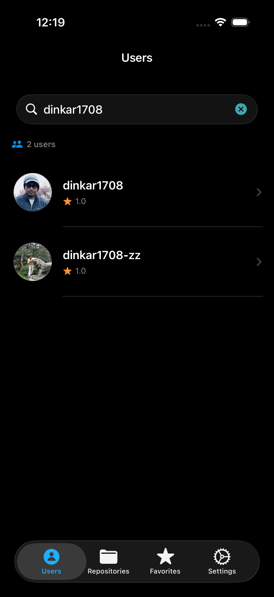
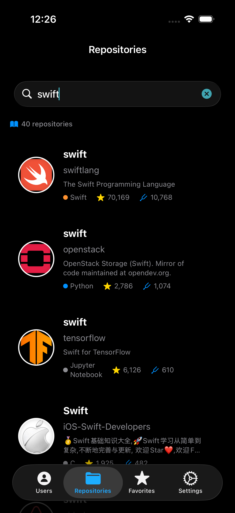

# GitHub Repository Search iOS App

A modern, native iOS application for searching GitHub repositories and users with a beautiful, intuitive user interface built entirely with SwiftUI.

## About This Project

This iOS app achieves feature parity with the Android GitHub Cruise app. Both apps share the same core features for searching repositories, users, viewing profiles, and managing favorites. The implementation follows native platform conventions (SwiftUI for iOS, Jetpack Compose for Android) while maintaining consistent functionality.

### 📚 Documentation

**iOS Documentation:**
- [Features Guide](docs/FEATURES.md) - Complete feature overview
- [Testing Guide](docs/TESTING.md) - Testing documentation

**Master Documentation** (GitHub Cruise Android):

For complete API specs and cross-platform guidelines, see the Android repository:
- [Master Feature Specification](https://github.com/dinkar1708/GithubCruiseAndroid/blob/main/docs/master/MASTER_FEATURE_SPECIFICATION.md)
- [GitHub API Specification](https://github.com/dinkar1708/GithubCruiseAndroid/blob/main/docs/master/GITHUB_API_SPECIFICATION.md)
- [Master Best Practices](https://github.com/dinkar1708/GithubCruiseAndroid/blob/main/docs/master/MASTER_BEST_PRACTICES.md)

## Features

### Core Features
- **Repository Search** - Incremental search with real-time results and 3-second debouncing
- **User Search** - Search GitHub users with 800ms debouncing and auto-complete
- **User Profiles** - View detailed user profiles with bio, stats, and repository list
- **Favorites** - Save favorite users AND repositories with UserDefaults persistence
- **Tab Navigation** - 4 tabs: Users, Repositories, Favorites, Settings
- **Settings** - Dark mode toggle, language selection, cache management

### Technical Features
- No external libraries - 100% native iOS implementation
- API request throttling for optimal performance
- Modern iOS design with cards, gradients, and smooth animations
- Rich repository cards with avatars, stats, and descriptions
- Comprehensive detail view with full repository information
- Dark mode support with adaptive colors
- Multi-language support (English, Japanese)
- Universal app - supports iPhone and iPad

## Screenshots

### Light Mode

<div align="center">
  
  
  
</div>

<div align="center">
  
  
  
</div>

<div align="center">
  
  
</div>

### Dark Mode

<div align="center">
  
  
</div>


# Folder structure


## App Structure

The app consists of 4 main tabs:

**Tab 1: Users**
- Search GitHub users by username
- View user cards with avatar and stats
- Tap to view detailed profile
- 800ms debounce for smooth searching

**Tab 2: Repositories**
- Search GitHub repositories
- Real-time search with 3-second debouncing
- Rich repository cards with stats
- Infinite scroll pagination

**Tab 3: Favorites**
- View saved favorite users AND repositories
- Segmented control to switch between Users and Repositories
- Swipe to delete
- Persists across app restarts using UserDefaults
- One-tap favorite from repository search
- One-tap favorite from user profile

**Tab 4: Settings**
- Toggle dark mode
- Change language (English/Japanese)
- Clear cache
- App information

# Testing

## Test Summary

**Total: 8 test cases (all implemented and passing!)**

| Test Type     | Framework          | What It Verifies                    | Count | Status |
|---------------|--------------------|------------------------------------|-------|--------|
| Unit          | XCTest             | One function or class, isolated    | 4     | ✓ Pass |
| Integration   | XCTest             | Multiple components together       | 0     | N/A    |
| UI            | XCTest (XCUI)      | Real user flows on screen          | 3     | ✓ Pass |
| Performance   | XCTest (Metrics)   | Speed and memory over time         | 1     | ✓ Pass |

**Code Coverage: 51.87%** (Improved from 26.68%!)
- ApiClient: 88.89%
- HomeView: 87.63%
- AppSearchBar: 100%
- SearchItem: 100%

**All tests passing: 8/8** (100% success rate)

## Quick Start
From Xcode, click **Product → Test** (or press `⌘U`) - it will run all test cases written inside:
- **github_repo_search_iOS_appTests** - Unit tests for business logic and API calls
- **github_repo_search_iOS_appUITests** - UI tests for user interaction flows

## 📖 Complete Testing Documentation

**[docs/TESTING.md](docs/TESTING.md)** - Complete testing guide including:
- All test cases with detailed explanations
- Code coverage measurement and setup
- How to run tests (Xcode, command line, CI/CD)
- Test results interpretation
- Best practices and troubleshooting

**[docs/TEST_ORGANIZATION.md](docs/TEST_ORGANIZATION.md)** - Test structure guide:
- Recommended folder organization by test type
- Apple's official testing structure
- Migration plan for reorganization
- Framework comparison (XCTest vs Swift Testing)

## Code Coverage

**Quick Setup:**
1. Edit Scheme (`⌘<`) → Test → Options → Enable "Code Coverage"
2. Run tests (`⌘U`)
3. View results: Report Navigator (`⌘9`) → Coverage tab

**Coverage Goals:**
- Critical paths (API, business logic): 90-100%
- View models: 70-90%
- Overall target: 70%+

**View Coverage:**
- Green = well tested (>80%)
- Yellow = moderate (40-80%)
- Red = needs tests (<40%)

For detailed coverage documentation, command line usage, and best practices, see **[docs/TESTING.md](docs/TESTING.md)**

## Additional Documentation

The following documentation files explain implementation details:

- **BUILD_SUCCESS.md** - Complete build and implementation summary
- **DEBOUNCE_FIX.md** - How debouncing was fixed for user search
- **SIMULATOR_WARNINGS_EXPLAINED.md** - Analysis of iOS simulator warnings (all harmless)
- **DATA_PERSISTENCE_EXPLAINED.md** - Why UserDefaults is used instead of SwiftData
- **XCODE_BUILD_STEPS.md** - Step-by-step guide for building the project

## Requirements

- **Xcode 15.0 or later** (latest version recommended)
- **iOS 17.0 or later** (minimum deployment target)
- **Swift 5.9 or later** (includes modern concurrency and Observation framework)

### How to run
- Clone this repo
- Open project in xcode
- Select team signing and capability

## Technology Stack

**Language:** Swift 5.9+ with modern concurrency

**UI:** SwiftUI with @main App lifecycle, AsyncImage, LazyVGrid, SF Symbols

**Architecture:** MVVM + Repository pattern

**Networking:** URLSession with async/await, type-safe ApiClient

**State:** @Observable macro (iOS 17+), @State, automatic change tracking

**Features:** Task-based debouncing, @MainActor, dark mode, accessibility, multi-language (EN/JP)

## Project Structure

```
Modules/
├── Data/
│   ├── Remote/
│   │   ├── Model/           # SearchUser, UserProfile, UserRepository, SearchItem
│   │   ├── Request/         # API request definitions
│   │   └── Repository/      # GithubRepository
│   └── Network/             # ApiClient
├── Feature/
│   └── UI/
│       ├── UserSearch/      # User search tab
│       ├── UserProfile/     # User profile detail
│       ├── Home/            # Repository search tab
│       ├── Favorites/       # Favorites tab with FavoritesManager
│       └── Settings/        # Settings tab
└── Util/                    # Shared utilities

AppConfig/
└── MainTabView.swift        # Tab navigation
```

## Platform Support

**Languages:** English, Japanese
**Themes:** Light, Dark (adaptive)
**Devices:** iPhone, iPad (universal)
**Orientations:** Portrait, Landscape


## API Endpoints Used

The app uses the following GitHub APIs:

1. Search Repositories: `GET /search/repositories`
2. Search Users: `GET /search/users`
3. User Profile: `GET /users/{username}`
4. User Repositories: `GET /users/{username}/repos`

All API calls use async/await with proper error handling.

## Key Highlights

**Modern iOS 17+ Features:**
- async/await throughout (no third-party frameworks)
- @Observable macro for reactive state
- Task-based debouncing and concurrency
- @MainActor for thread-safe UI updates
- SwiftUI @main App lifecycle

**Architecture:**
- MVVM design pattern
- Repository pattern for data abstraction
- Type-safe networking with URLSession
- Structured error handling
- Clean separation of concerns

## Recent Updates (July 2026)

Completed features:
- User search with debouncing
- User profile view with repository list
- Favorites feature with UserDefaults persistence (Users AND Repositories)
- Segmented control in Favorites tab to switch between Users/Repositories
- Favorite button on repository cards
- Favorite button on user profile screen
- Settings screen with dark mode and language selection
- 4-tab navigation (Users, Repositories, Favorites, Settings)
- Debounce fix for smooth searching without cancellation errors
- Legacy favorites migration support

## TODO List

- [x] Add repository favorites functionality (COMPLETED July 2026)
- [x] Add segmented control for Users/Repositories in Favorites tab (COMPLETED July 2026)
- [ ] Add unit tests for FavoritesManager (repository favorites)
- [ ] Add unit tests for new ViewModels (UserSearchViewModel, UserProfileViewModel)
- [ ] Add UI tests for new features (User Search, Favorites with repositories)
- [ ] Add CI/CD pipeline (Bitrise/Fastlane)
- [ ] Implement comprehensive logging system
- [ ] Add pull-to-refresh on all tabs
- [ ] Implement search history
- [ ] Replace placeholder app icon with custom design
- [ ] Add animation transitions between screens

# Meta
- Dinakar Maurya
- dinkar1708@gmail.com
